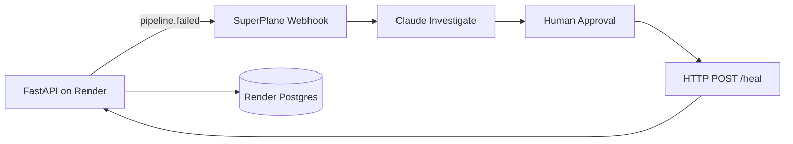

# DE-Guardian — Pipeline Incident Investigator

[](http://app.superplane.com/install?repo=github.com/madhukoseke/de-guardian)

**SuperPlane Hackathon 2026** · **Track 1: Canvas + Console**

AI-powered incident response for data pipelines. A simulated fintech job (`daily_revenue_aggregation`) fails on cue with realistic DataOps incidents. On failure it emits a rich event to a **SuperPlane Canvas**, where a Claude agent investigates root cause, a human approves remediation, and the pipeline self-heals — every step logged.

This repo is the **service side**. The Canvas workflow is defined in [`canvas.yaml`](./canvas.yaml).

## Architecture



| Layer | Role |
| --- | --- |
| **This repo** | Simulated pipeline, failure modes, incident webhook, `/heal` remediation |
| **SuperPlane Canvas** | Investigate → approve → remediate → notify (audit trail) |
| **Render** | Web Service + Cron Job + Postgres (partner track: 2+ services) |

## Quick start (local)

```bash
pip install -r requirements.txt
uvicorn app.main:app --reload --port 8000
```

```bash
curl -X POST localhost:8000/run                       # healthy run
curl -X POST "localhost:8000/break?mode=schema_drift" # arm a failure
curl -X POST localhost:8000/run                        # fails + incident payload
curl localhost:8000/runs                               # audit trail
curl -X POST localhost:8000/heal                       # remediate
```

No `DATABASE_URL`? In-memory store. No `SUPERPLANE_WEBHOOK_URL`? Incident JSON is returned in the `/run` response for Canvas Manual Run testing.

## Failure modes (`GET /modes`)

| mode | reproduces |
| --- | --- |
| `schema_drift` | upstream renamed `amount` → `txn_amount`; transform breaks (KeyError) |
| `null_violation` | NULL revenue hits a NOT NULL column |
| `upstream_timeout` | source API 504 after 30s |
| `type_mismatch` | `'N/A'` can't cast to numeric |
| `duplicate_pk` | duplicate `transaction_id` on load |

Demo scenario: `schema_drift` — the agent correlates the error to the "source-api v3" commit from `recent_changes`.

## Deploy to Render

1. Repo is on GitHub (public for judges). See [`RENDER_DEPLOY.md`](./RENDER_DEPLOY.md).
2. Render: **New + → Blueprint** → connect repo. [`render.yaml`](./render.yaml) provisions Web + Cron + Postgres.
3. Create the SuperPlane **Webhook** trigger (see [`CANVAS_SETUP.md`](./CANVAS_SETUP.md)); copy its URL.
4. Set on **web** and **cron** services:
   - `SUPERPLANE_WEBHOOK_URL` — Canvas webhook URL
   - `SERVICE_BASE_URL` — e.g. `https://bash-script-funeral.onrender.com` (for Canvas heal step)
   - `DATABASE_URL` — auto-linked from blueprint

## SuperPlane App (Track 1 submission)

This repo follows the [preview-env-digitalocean](https://github.com/superplanehq/app_preview-env-digitalocean) layout:

| File | Purpose |
| --- | --- |
| [`canvas.yaml`](./canvas.yaml) | Webhook → Claude → Approval → Heal → Memory |
| [`console.yaml`](./console.yaml) | Incident table + re-run from Console |

### Import

1. Create org `hackatonsf-<team-name>` on [app.superplane.com](https://app.superplane.com)
2. Click **Launch in SuperPlane** (badge above) or:

```bash
superplane connect https://app.superplane.com <API_TOKEN>
superplane canvases create --file canvas.yaml
```

3. Replace `REPLACE_CLAUDE_INTEGRATION_ID` in `canvas.yaml` with your Claude integration UUID
4. Set `REPLACE_CANVAS_ID` in `console.yaml`, then apply console in UI or CLI
5. Copy Webhook URL from **Pipeline Failed** node → `SUPERPLANE_WEBHOOK_URL` on Render

Build incrementally in UI if import fails — see [`CANVAS_SETUP.md`](./CANVAS_SETUP.md).

## Environment variables

See [`.env.example`](./.env.example).

| Variable | Purpose |
| --- | --- |
| `SUPERPLANE_WEBHOOK_URL` | Canvas webhook trigger URL |
| `SERVICE_BASE_URL` | Public base URL for `/heal` in incident payload |
| `DATABASE_URL` | Render Postgres (optional locally) |
| `RENDER_SERVICE_NAME` | Service label in incidents |

## API

| method | path | purpose |
| --- | --- | --- |
| GET | `/` | status + links |
| GET | `/health` | Render health check |
| GET | `/modes` | list failure modes |
| POST | `/run` | run once (emits incident on failure) |
| POST | `/break?mode=` | arm a failure mode |
| POST | `/heal` | clear failure (Canvas calls after approval) |
| GET | `/status` | current mode + last run |
| GET | `/runs?limit=` | recent run history |
