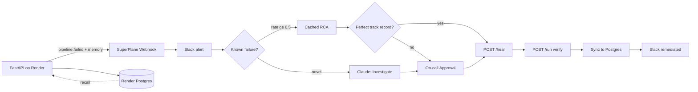

# DE-Guardian — Pipeline Incident Investigator

[](http://app.superplane.com/install?repo=github.com/madhukoseke/de-guardian)

A data pipeline fails on cue with a realistic incident. It POSTs the failure to a
[SuperPlane Canvas](./canvas.yaml), where **incident memory is checked first** —
known failures with a strong track record skip Claude and use a cached RCA; perfect
track records can auto-heal. Novel failures go to Claude, then on-call approves,
heal → verify → record — with Slack alerts at each stage.

The agent doesn't reason from the error alone. Each incident carries an **incident
memory** block: how often this failure has happened before and how often the run
after it recovered. So the agent argues from track record, not a guess:

```jsonc
// first time
"memory": { "prior_occurrences": 0, "auto_remediation_success_rate": null,
            "note": "No prior schema_drift incidents — treat as novel; prefer human review." }

// after it has self-healed a few times
"memory": { "prior_occurrences": 3, "auto_remediation_success_rate": 1.0,
            "note": "schema_drift has self-healed 3/3 times — strong track record; safe to automate." }
```

This repo is the **service side**. The Canvas workflow lives in [`canvas.yaml`](./canvas.yaml).

## Architecture



| Layer | Role |
| --- | --- |
| **This repo** | Pipeline, auth, incident webhook + retries, memory, heal/verify API |
| **SuperPlane Canvas** | Memory-first → approve/auto-heal → verify → sync + Slack alerts |
| **Render** | Web Service + Cron Job + Postgres |

## Quick start

```bash
pip install -r requirements.txt
pytest -q
uvicorn app.main:app --reload --port 8000
```

```bash
curl -X POST localhost:8000/run                        # healthy run
curl -X POST "localhost:8000/break?mode=schema_drift"  # arm a failure
curl -X POST localhost:8000/run                         # fails + emits incident
curl "localhost:8000/memory?mode=schema_drift"          # what the agent recalls
curl -X POST localhost:8000/heal                        # remediate
curl localhost:8000/runs                                # audit trail
```

Locally, mutating endpoints work without auth unless `API_KEY` is set. On Render, `API_KEY` is required:

```bash
export API_KEY=dev-secret   # match REPLACE_DE_GUARDIAN_API_KEY in canvas.yaml
curl -H "Authorization: Bearer $API_KEY" -X POST localhost:8000/break?mode=schema_drift
curl -H "Authorization: Bearer $API_KEY" -X POST localhost:8000/run
```

### Manual Run fixtures (SuperPlane)

| Fixture | Path |
| --- | --- |
| Known failure (memory fast path) | [`fixtures/schema_drift_incident.json`](./fixtures/schema_drift_incident.json) |
| Novel failure (Claude path) | [`fixtures/schema_drift_incident_novel.json`](./fixtures/schema_drift_incident_novel.json) |
| Cloud Manual Run (public URLs) | [`fixtures/schema_drift_incident_cloud.json`](./fixtures/schema_drift_incident_cloud.json) |

## Failure modes (`GET /modes`)

| mode | reproduces |
| --- | --- |
| `schema_drift` | upstream renamed `amount` → `txn_amount`; transform breaks (KeyError) |
| `null_violation` | NULL revenue hits a NOT NULL column |
| `upstream_timeout` | source API 504 after 30s |
| `type_mismatch` | `'N/A'` can't cast to numeric |
| `duplicate_pk` | duplicate `transaction_id` on load |

Demo path: `schema_drift` — the agent correlates the error to the "source-api v3"
commit in `recent_changes`, and cites prior occurrences from `memory`.

## Incident memory

Memory is derived from the run-history audit trail ([`app/db.py`](./app/db.py)), not a
separate store. For a given failure mode, [`app/memory.py`](./app/memory.py) counts
prior occurrences and checks whether the run after each one recovered — yielding an
auto-remediation success rate.

Every `pipeline.failed` event carries `memory` plus an `investigation` block. Claude is
skipped when `prior_occurrences > 0` **and** `auto_remediation_success_rate >= 0.5`
(configurable via `MEMORY_SKIP_CLAUDE_MIN_RATE`). Remediation is counted only when `/heal`
preceded the next successful run — cron-only successes do not inflate the rate.

Canvas outcomes sync back via `POST /incidents/status` (dual-memory: Postgres + SuperPlane table).

## Production hardening

| Area | Implementation |
| --- | --- |
| Auth | `API_KEY` on `/break`, `/heal`, `/run`, `/incidents/status` |
| Health | `GET /health` probes Postgres |
| Webhooks | 3× retry, idempotency key, delivery audit in Postgres |
| State | Armed mode + heal events persisted in Postgres (web + cron share) |
| Canvas | Verify-after-heal, HTTP retries, heal-failure branch, on-call approval |
| Slack | Service webhook (`SLACK_WEBHOOK_URL`) + canvas nodes (incident, reject, remediated) |
| Tests | `pytest` — memory, events, API, Slack, DB (`tests/`) |
| CI | GitHub Actions on push/PR |

## Deploy to Render

1. Push to GitHub (public for judges). See [`RENDER_DEPLOY.md`](./RENDER_DEPLOY.md).
2. Render **New + → Blueprint** → connect repo. [`render.yaml`](./render.yaml) provisions Web + Cron + Postgres.
3. Create the SuperPlane **Webhook** trigger ([`CANVAS_SETUP.md`](./CANVAS_SETUP.md)); copy its URL.
4. On the **web** and **cron** services set: `API_KEY`, `SUPERPLANE_WEBHOOK_URL`, `SUPERPLANE_WEBHOOK_SECRET`, `SERVICE_BASE_URL`. Optional: `SLACK_WEBHOOK_URL`. `DATABASE_URL` is auto-linked.

## SuperPlane import

| File | Purpose |
| --- | --- |
| [`canvas.yaml`](./canvas.yaml) | Webhook → memory/Claude → approve → heal → verify → sync |
| [`console.yaml`](./console.yaml) | Incident table + heal-then-rerun from Console |

1. Create an org on [app.superplane.com](https://app.superplane.com).
2. Click **Launch in SuperPlane** (badge above), or `superplane canvases create --file canvas.yaml`.
3. Replace placeholders in `canvas.yaml` (`REPLACE_CLAUDE_INTEGRATION_ID`, `REPLACE_SLACK_INTEGRATION_ID`, `REPLACE_DE_GUARDIAN_API_KEY`, `REPLACE_SLACK_CHANNEL_ID`, `REPLACE_ONCALL_GROUP_ID`).
4. Set `REPLACE_CANVAS_ID` in `console.yaml`, then apply.
5. Copy the **Pipeline Failed** webhook URL → `SUPERPLANE_WEBHOOK_URL` on Render.

If import fails, build in the UI — see [`CANVAS_SETUP.md`](./CANVAS_SETUP.md).

## Environment variables

See [`.env.example`](./.env.example).

| Variable | Purpose |
| --- | --- |
| `API_KEY` | Auth for mutating endpoints (required on Render) |
| `SUPERPLANE_WEBHOOK_URL` | Canvas webhook trigger URL |
| `SUPERPLANE_WEBHOOK_SECRET` | HMAC signing key (required in prod when URL set) |
| `SERVICE_BASE_URL` | Public base URL for heal/run in incident payload |
| `DATABASE_URL` | Render Postgres (optional locally) |
| `MEMORY_SKIP_CLAUDE_MIN_RATE` | Min success rate to skip Claude (default 0.5) |
| `SLACK_WEBHOOK_URL` | Optional Slack Incoming Webhook for direct incident alerts |
| `RENDER_SERVICE_NAME` | Service label in incidents |

## API

| method | path | purpose |
| --- | --- | --- |
| GET | `/` | status + links |
| GET | `/health` | Deep health check (Postgres probe) |
| GET | `/modes` | list failure modes |
| POST | `/run` | run once (auth; emits incident on failure) |
| POST | `/break?mode=` | arm a failure mode (auth) |
| POST | `/heal` | clear failure (auth; canvas calls after approval) |
| GET | `/status` | current armed mode + last web run |
| GET | `/runs?limit=` | recent run history |
| GET | `/memory?mode=` | incident memory + investigation routing hint |
| GET | `/incidents` | Postgres-synced canvas outcomes |
| POST | `/incidents/status` | canvas sync endpoint (auth) |
