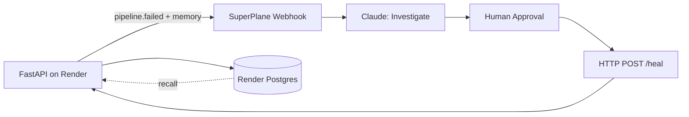

# DE-Guardian — Pipeline Incident Investigator

[](http://app.superplane.com/install?repo=github.com/madhukoseke/de-guardian)

A data pipeline fails on cue with a realistic incident. It POSTs the failure to a
[SuperPlane Canvas](./canvas.yaml), where Claude investigates the root cause, a
human approves, and the pipeline self-heals — every step logged.

The agent doesn't reason from the error alone. Each incident carries an **incident
memory** block: how often this failure has happened before and how often the run
after it recovered. So the agent argues from track record, not a guess:

```jsonc
// first time
"memory": { "prior_occurrences": 0, "auto_remediation_success_rate": null,
            "note": "No prior schema_drift incidents — treat as novel; prefer human review." }

// after it has self-healed a few times
"memory": { "prior_occurrences": 3, "auto_remediation_success_rate": 1.0,
            "note": "schema_drift has self-healed 3/3 times — strong track record; safe to automate." }
```

This repo is the **service side**. The Canvas workflow lives in [`canvas.yaml`](./canvas.yaml).

## Architecture



| Layer | Role |
| --- | --- |
| **This repo** | Pipeline, failure modes, incident webhook, incident memory, `/heal` |
| **SuperPlane Canvas** | Investigate → approve → remediate → record (audit trail) |
| **Render** | Web Service + Cron Job + Postgres |

## Quick start

```bash
pip install -r requirements.txt
uvicorn app.main:app --reload --port 8000
```

```bash
curl -X POST localhost:8000/run                        # healthy run
curl -X POST "localhost:8000/break?mode=schema_drift"  # arm a failure
curl -X POST localhost:8000/run                         # fails + emits incident
curl "localhost:8000/memory?mode=schema_drift"          # what the agent recalls
curl -X POST localhost:8000/heal                        # remediate
curl localhost:8000/runs                                # audit trail
```

No `DATABASE_URL`? In-memory store. No `SUPERPLANE_WEBHOOK_URL`? The incident JSON
is returned in the `/run` response for Canvas Manual Run testing.

## Failure modes (`GET /modes`)

| mode | reproduces |
| --- | --- |
| `schema_drift` | upstream renamed `amount` → `txn_amount`; transform breaks (KeyError) |
| `null_violation` | NULL revenue hits a NOT NULL column |
| `upstream_timeout` | source API 504 after 30s |
| `type_mismatch` | `'N/A'` can't cast to numeric |
| `duplicate_pk` | duplicate `transaction_id` on load |

Demo path: `schema_drift` — the agent correlates the error to the "source-api v3"
commit in `recent_changes`, and cites prior occurrences from `memory`.

## Incident memory

Memory is derived from the run-history audit trail ([`app/db.py`](./app/db.py)), not a
separate store. For a given failure mode, [`app/memory.py`](./app/memory.py) counts
prior occurrences and checks whether the run after each one recovered — yielding an
auto-remediation success rate. It rides on every `pipeline.failed` event under
`memory`, and the Canvas prompt weighs it: a strong track record justifies
automation; a novel failure stays conservative.

## Deploy to Render

1. Push to GitHub (public for judges). See [`RENDER_DEPLOY.md`](./RENDER_DEPLOY.md).
2. Render **New + → Blueprint** → connect repo. [`render.yaml`](./render.yaml) provisions Web + Cron + Postgres.
3. Create the SuperPlane **Webhook** trigger ([`CANVAS_SETUP.md`](./CANVAS_SETUP.md)); copy its URL.
4. On the **web** and **cron** services set: `SUPERPLANE_WEBHOOK_URL`, `SERVICE_BASE_URL`, `DATABASE_URL` (auto-linked).

## SuperPlane import

| File | Purpose |
| --- | --- |
| [`canvas.yaml`](./canvas.yaml) | Webhook → Claude → Approval → Heal → Record |
| [`console.yaml`](./console.yaml) | Incident table + re-run from Console |

1. Create an org on [app.superplane.com](https://app.superplane.com).
2. Click **Launch in SuperPlane** (badge above), or `superplane canvases create --file canvas.yaml`.
3. Replace `REPLACE_CLAUDE_INTEGRATION_ID` in `canvas.yaml` with your Claude integration UUID.
4. Set `REPLACE_CANVAS_ID` in `console.yaml`, then apply.
5. Copy the **Pipeline Failed** webhook URL → `SUPERPLANE_WEBHOOK_URL` on Render.

If import fails, build in the UI — see [`CANVAS_SETUP.md`](./CANVAS_SETUP.md).

## Environment variables

See [`.env.example`](./.env.example).

| Variable | Purpose |
| --- | --- |
| `SUPERPLANE_WEBHOOK_URL` | Canvas webhook trigger URL |
| `SUPERPLANE_WEBHOOK_SECRET` | HMAC signing key (optional) |
| `SERVICE_BASE_URL` | Public base URL for `/heal` in the incident payload |
| `DATABASE_URL` | Render Postgres (optional locally) |
| `RENDER_SERVICE_NAME` | Service label in incidents |

## API

| method | path | purpose |
| --- | --- | --- |
| GET | `/` | status + links |
| GET | `/health` | Render health check |
| GET | `/modes` | list failure modes |
| POST | `/run` | run once (emits incident on failure) |
| POST | `/break?mode=` | arm a failure mode |
| POST | `/heal` | clear failure (Canvas calls after approval) |
| GET | `/status` | current mode + last run |
| GET | `/runs?limit=` | recent run history |
| GET | `/memory?mode=` | incident memory for a failure mode |
