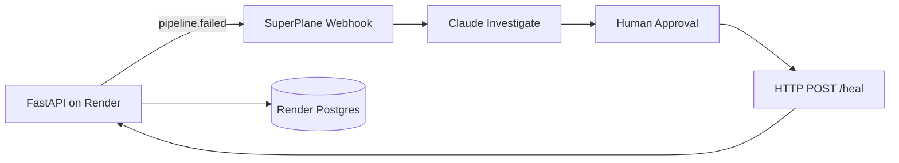

# DE-Guardian — Pipeline Incident Investigator

**SuperPlane Hackathon 2026** · *Bash Script Funeral /w Render*

AI-powered incident response for data pipelines. A simulated fintech job (`daily_revenue_aggregation`) fails on cue with realistic DataOps incidents. On failure it emits a rich event to a **SuperPlane Canvas**, where a Claude agent investigates root cause, a human approves remediation, and the pipeline self-heals — every step logged.

This repo is the **service side**. The Canvas workflow is specified in [`canvas-spec.md`](./canvas-spec.md).

## Architecture



| Layer | Role |
| --- | --- |
| **This repo** | Simulated pipeline, failure modes, incident webhook, `/heal` remediation |
| **SuperPlane Canvas** | Investigate → approve → remediate → notify (audit trail) |
| **Render** | Web Service + Cron Job + Postgres (partner track: 2+ services) |

## Quick start (local)

```bash
pip install -r requirements.txt
uvicorn app.main:app --reload --port 8000
```

```bash
curl -X POST localhost:8000/run                       # healthy run
curl -X POST "localhost:8000/break?mode=schema_drift" # arm a failure
curl -X POST localhost:8000/run                        # fails + incident payload
curl localhost:8000/runs                               # audit trail
curl -X POST localhost:8000/heal                       # remediate
```

No `DATABASE_URL`? In-memory store. No `SUPERPLANE_WEBHOOK_URL`? Incident JSON is returned in the `/run` response for Canvas Manual Run testing.

## Failure modes (`GET /modes`)

| mode | reproduces |
| --- | --- |
| `schema_drift` | upstream renamed `amount` → `txn_amount`; transform breaks (KeyError) |
| `null_violation` | NULL revenue hits a NOT NULL column |
| `upstream_timeout` | source API 504 after 30s |
| `type_mismatch` | `'N/A'` can't cast to numeric |
| `duplicate_pk` | duplicate `transaction_id` on load |

**Live demo:** `schema_drift` — the agent correlates the error to the "source-api v3" commit from `recent_changes`.

## Deploy to Render

1. Push this repo to GitHub (public for judges).
2. Render: **New + → Blueprint** → connect repo. [`render.yaml`](./render.yaml) provisions Web + Cron + Postgres.
3. Create the SuperPlane **Webhook** trigger (see `canvas-spec.md`); copy its URL.
4. Set on **web** and **cron** services:
   - `SUPERPLANE_WEBHOOK_URL` — Canvas webhook URL
   - `SERVICE_BASE_URL` — e.g. `https://bash-script-funeral.onrender.com` (for Canvas heal step)
   - `DATABASE_URL` — auto-linked from blueprint

## SuperPlane Canvas setup

Build incrementally on the event-hosted instance:

1. **Webhook** ← this service POSTs `pipeline.failed` events
2. **Claude** ← investigation prompt in `canvas-spec.md`
3. **Approval** ← human sign-off before remediation
4. **HTTP Request** → `POST {{ context.heal_url }}` (full URL in payload)
5. **Slack** (optional) ← RCA + outcome

Canvas name for submission: **DE-Guardian: Schema Drift Recovery**

## Environment variables

See [`.env.example`](./.env.example).

| Variable | Purpose |
| --- | --- |
| `SUPERPLANE_WEBHOOK_URL` | Canvas webhook trigger URL |
| `SERVICE_BASE_URL` | Public base URL for `/heal` in incident payload |
| `DATABASE_URL` | Render Postgres (optional locally) |
| `RENDER_SERVICE_NAME` | Service label in incidents |

## API

| method | path | purpose |
| --- | --- | --- |
| GET | `/` | status + links |
| GET | `/health` | Render health check |
| GET | `/modes` | list failure modes |
| POST | `/run` | run once (emits incident on failure) |
| POST | `/break?mode=` | arm a failure mode |
| POST | `/heal` | clear failure (Canvas calls after approval) |
| GET | `/status` | current mode + last run |
| GET | `/runs?limit=` | recent run history |

## Stage demo

1. Print [`run-of-show-card.html`](./run-of-show-card.html) (Letter PDF).
2. Show [`the-corpse.sh`](./the-corpse.sh) EULOGY — bury the bash script.
3. Break live: `schema_drift` → SuperPlane Canvas → approve → heal → green run.
4. Show SuperPlane run history + `GET /runs`.

**3-minute pitch:** Data pipeline incidents still rely on logs, bash, and tribal knowledge. DE-Guardian brings AI investigation, safe remediation, and auditable workflows — built with SuperPlane and Render, designed as reusable workflows you can clone and improve.

## OneAISpace (vision)

OneAISpace is building a **Workflows** layer alongside Tools and Prompts — shareable, forkable operational playbooks. **DE-Guardian: Schema Drift Recovery** is the first workflow concept: trigger, investigation steps, AI analysis, approval gate, audit trail, and rollback plan. No OneAISpace integration in this repo today; the Canvas export is the artifact.

## Repo layout

```
app/           FastAPI, pipeline simulation, incidents, db
jobs/          Render cron entrypoint
canvas-spec.md SuperPlane node graph + Claude prompt
render.yaml    Blueprint: web + cron + postgres
the-corpse.sh  Bash script funeral prop
run-of-show-card.html
```

## Hackathon prizes

| Track | How DE-Guardian qualifies |
| --- | --- |
| Main | Real DataOps incidents, live multi-node workflow |
| Best Use of AI Agents | Claude RCA with evidence + confidence |
| Render | Web + Cron + Postgres via blueprint |
